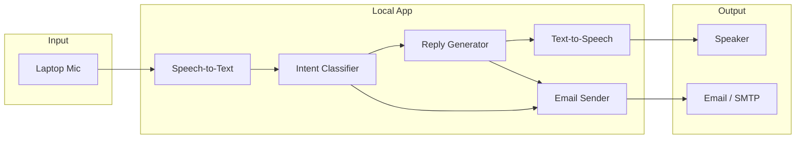

# AI Receptionist – Implementation Plan

## Purpose

Build a **local** AI receptionist that:

- Takes input from the laptop microphone
- Classifies intent: **issue** | **booking inquiry** | **booking**
- Replies by voice accordingly
- Sends emails for issues and for bookings (everything "handled" via email)
- Uses **free resources** only
- Is implemented in **JavaScript**
- Has this implementation plan document at project root

---

## High-Level Architecture



- **Input**: Laptop mic → Speech-to-Text (STT).
- **Processing**: Intent classification (issue / booking inquiry / booking) + reply generation.
- **Output**: Text-to-Speech (TTS) to user + email for issues and bookings.

---

## Intent Definitions

1. **Issue** – Customer reports a problem, complaint, or request for help (e.g. "My booking was wrong", "I never received confirmation").
2. **Booking inquiry** – Customer asks about availability, options, or how to book (e.g. "Do you have slots tomorrow?", "How do I book?").
3. **Booking** – Customer states a concrete booking request (e.g. "I want to book for two at 7pm", "Book a table for Saturday").

Issue and booking **must** result in an email; booking inquiry can optionally trigger email.

---

## Data Flow

1. User speaks → **STT** (browser) → **Transcript**.
2. Transcript → **Backend** → **LLM**: intent + reply (+ optional payload for email).
3. Backend returns **reply text** and **intent** to frontend.
4. Frontend uses **TTS** to speak the reply to the user.
5. If intent is **issue** or **booking** (and optionally **booking_inquiry**): backend sends email with intent, transcript/summary, and any structured details. Everything handled via email; no separate ticket system.

---

## Tech Stack (Free Resources)

| Layer          | Technology                                               |
| -------------- | -------------------------------------------------------- |
| Runtime        | Node.js                                                  |
| STT            | Browser Web Speech API                                   |
| Intent + reply | Groq or Hugging Face Inference or OpenAI free tier       |
| TTS            | Browser Web Speech API                                   |
| Email          | Resend (3k/mo) HTTP API                                  |
| App shape      | Next.js (App Router): React UI + Route Handler `/api/process` |

---

## Project Structure

```
gmail_receptionist/
├── implementation-plan.md
├── README.md
├── package.json
├── next.config.mjs
├── jsconfig.json
├── .env.example
├── app/
│   ├── layout.jsx
│   ├── page.jsx
│   ├── globals.css
│   └── api/process/route.js
├── lib/
│   ├── intent.js
│   ├── email.js
│   └── prompts.js
└── .gitignore
```

---

## Implementation Checklist

1. **Implementation plan document** – This file at project root (purpose, architecture, intents, flow, stack, structure, steps).
2. **Backend** – Next.js Route Handler `POST /api/process`, LLM for intent+reply, Resend email, env-based config (same-origin; no separate CORS for the app).
3. **Frontend** – `app/page.jsx` (client): Start/Stop listening, Web Speech API (STT + TTS), `fetch('/api/process')`, activity log.
4. **Prompts and robustness** – System prompt returns only the three intents and valid JSON; validate intent in code; fallback for unknown.
5. **Configuration and docs** – .env.example (LLM_API_KEY, LLM_PROVIDER, RESEND_API_KEY, EMAIL_FROM optional), README with run instructions.
6. **Security** – No hardcoded secrets; validate/sanitize transcript length and request body size on the API route.

---

## Free Tier Limits

- Groq / Hugging Face / OpenAI: rate and daily limits; keep prompts small.
- Resend: 3,000 emails/month; SendGrid: 100/day.
- Web Speech API: browser-dependent; Chrome/Edge; HTTPS may be required in production (not for localhost).

---

## Out of Scope (For Now)

- No persistent DB (only email).
- No production deploy or HTTPS (local only).
- No auth (single user, local).
- No calendar integration – booking forwarded by email only.
